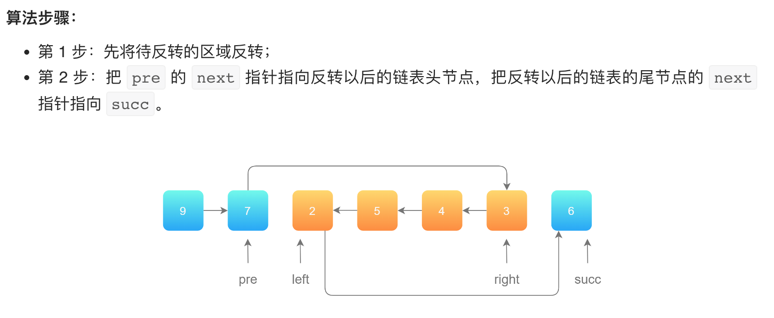

# 按照"出题指数"刷
https://leetcode.cn/company/bytedance/problemset/

目录在最后

[3. 无重复字符的最长子串](https://leetcode.cn/problems/longest-substring-without-repeating-characters/)

```python
class Solution:
    def lengthOfLongestSubstring(self, s: str) -> int:
        d = dict()
        tmp = 0
        res = 0
        start = 0
        for i, j in enumerate(s):
            if j not in d or (j in d and d[j] < start):
                d[j] = i
                tmp += 1
                res = max(res, tmp )
            else:
                start = d[j] + 1 # 目前的j已经出现过之前的答案里，start需要更新为start位置+1
                tmp = i - d[j] # 长度
                d[j] = i # 更新目前的j的index
                res = max(res, tmp )
            # print(j, tmp, s[start: start + tmp])
        return res 
```

[2. 两数相加](https://leetcode.cn/problems/add-two-numbers/)


```python
# Definition for singly-linked list.
# class ListNode:
#     def __init__(self, val=0, next=None):
#         self.val = val
#         self.next = next
class Solution:
    def addTwoNumbers(self, l1: Optional[ListNode], l2: Optional[ListNode]) -> Optional[ListNode]:
        surplus = 0 # 进位
        p1, p2 = l1, l2 
        res = ListNode(0)
        head = res 
        while p1 and p2:
            curr = p1.val + p2.val + surplus
            if curr >= 10:
                curr, surplus = curr - 10, 1
            else:
                surplus = 0
            head.next = ListNode(curr)
            head = head.next
            p1, p2 = p1.next, p2.next
        while p1:
            curr = p1.val + surplus 
            if curr >= 10:
                curr, surplus = curr - 10, 1
            else:
                surplus = 0
            head.next = ListNode(curr)
            head = head.next
            p1 = p1.next
        while p2:
            curr = p2.val + surplus 
            if curr >= 10:
                curr, surplus = curr - 10, 1
            else:
                surplus = 0
            head.next = ListNode(curr)
            head = head.next
            p2 = p2.next
        if surplus:
            head.next = ListNode(1)
            head = head.next 
        return res.next
```

[5. 最长回文子串](https://leetcode.cn/problems/longest-palindromic-substring/)


执行用时：
6820 ms
, 在所有 Python3 提交中击败了
32.47%
的用户
内存消耗：
23.7 MB
, 在所有 Python3 提交中击败了
7.30%
的用户

```python
class Solution:
    def longestPalindrome(self, s: str) -> str:
        res = (0,0)
        length = 0
        n = len(s)
        dp = [[True for _ in range(n)] for _ in range(n)]

        for i in range(n-1, -1, -1):
            for j in range(i+1, n):
                dp[i][j] = s[i]==s[j] and dp[i+1][j-1]
                if dp[i][j] and j - i + 1 > length:
                    res = (i, j)
                    length = j - i + 1
        return s[res[0]: res[1]+1]
```

[15. 三数之和](https://leetcode.cn/problems/3sum/)

```python
class Solution:
    def threeSum(self, nums: List[int]) -> List[List[int]]:
        ans = list()
        n = len(nums)
        if n <= 2:
            return list()
        nums.sort()
        l, r = 0, n - 1
        for first in range(n):
            if first > 0 and nums[first-1] == nums[first]:
                continue # 继续往前找first不同的数
            elif nums[first] > 0: # 加上该句，时间从 44%->80%
                break 
            third = n - 1
            target = - nums[first]
            for second in range(first + 1, n):
                if second > first + 1 and nums[second-1] == nums[second]:
                    continue
                while third > second and nums[third] + nums[second] > target:
                    third -= 1
                if second == third:
                    break
                if nums[second] + nums[third] == target:
                    ans.append([ nums[first], nums[second], nums[third] ])
        return ans 
```

[11. 盛最多水的容器](https://leetcode.cn/problems/container-with-most-water/)


- 解法：反证法：hl < hr时，就算r--，hr变大变小，因为hl是min，所以面积肯定变小，则应该l++

```python
class Solution:
    def maxArea(self, height: List[int]) -> int:
        ans = 0
        n = len(height)
        l, r = 0, n - 1
        while l < r:
            hl, hr = height[l], height[r]
            h = min(hl, hr )
            ans = max(h * (r - l), ans)
            if hl < hr :
                l += 1
            else:
                r -= 1 
        return ans
```

[46. 全排列](https://leetcode.cn/problems/permutations/)

```python
class Solution:
    def permute(self, nums: List[int]) -> List[List[int]]:
        n = len(nums)
        ans = list()
        visit = [0 for _ in range(n)] 
        def dfs(visit, curr):
            nonlocal ans 
            if sum(visit) == n:
                ans.append(list(curr))
                return 
            for i, j in enumerate(visit):
                if j == 0:
                    visit[i] = 1
                    curr.append(nums[i])
                    dfs(visit, curr)
                    visit[i] = 0
                    curr.pop()
        
        dfs(visit, list())
        return ans 
```

[33. 搜索旋转排序数组](https://leetcode.cn/problems/search-in-rotated-sorted-array/)

```python
class Solution:
    def search(self, nums: List[int], target: int) -> int:
        n = len(nums)
        if len(nums)==1:
            return 0 if nums[0]==target else -1
        if len(nums)==2:
            return 0 if nums[0]==target else 1 if nums[1]==target else -1
        l, r = 0, n - 1
        while l < r:
            m = (r + l) >> 1
            a, b, c = nums[l], nums[m], nums[r]
            # print(a, b, c)
            # 如果没有明显的l和r的m+-项，则需要判断a、c是否等于target，且l<r；要么就需要写好m+-1的变更条件，才要l<=r
            if b == target:
                return m 
            if a == target:
                return l 
            if c == target:
                return r
            if c < a and b <= c:
                if target < b or target > a:
                    r = m - 1
                else:
                    l = m
            elif c < a and b >= a:
                if target > b or target < c:
                    l = m + 1
                else:
                    r = m
            elif a < c:
                if target > b:
                    l = m + 1
                else:
                    r = m - 1
        if b == target:
            return m 
        return -1
```


[56. 合并区间](https://leetcode.cn/problems/merge-intervals/)

```python
class Solution:
    def merge(self, intervals: List[List[int]]) -> List[List[int]]:
        ans = list()
        intervals.sort(key = lambda x: x[0])
        for i, j in enumerate(intervals):
            if len(ans)==0 or j[0] > ans[-1][1]:
                ans.append(j)
            else:
                ans[-1][1] = max(ans[-1][1],j[1])
        return ans 
```

[31. 下一个排列](https://leetcode.cn/problems/next-permutation/)

- [参考](https://leetcode.cn/problems/next-permutation/solution/xia-yi-ge-pai-lie-by-leetcode-solution/)

```python
class Solution:
    def nextPermutation(self, nums: List[int]) -> None:
        """
        Do not return anything, modify nums in-place instead.
        """
        n = len(nums)
        i = n - 2
        while i >= 0 and nums[i] >= nums[i+1]:
            i -= 1
        if i >= 0:
            j = len(nums) - 1
            while j >= 0 and nums[i] >= nums[j]:
                j -= 1
            nums[i], nums[j] = nums[j], nums[i]
        
        i, j = i + 1, len(nums) - 1
        while i < j:
            nums[i], nums[j] = nums[j], nums[i]
            i += 1
            j -= 1
```

[200. 岛屿数量](https://leetcode.cn/problems/number-of-islands/)

```python
class Solution:
    def numIslands(self, grid: List[List[str]]) -> int:
        
        def dfs(last_dir, curr_dir, i, j):
            # nonlocal self.visited
            if (last_dir == 'down' and curr_dir == 'up') or (last_dir == 'up' and curr_dir == 'down'):
                return 
            if (last_dir == 'right' and curr_dir == 'left') or (last_dir == 'left' and curr_dir == 'right'):
                return 
            # last_dir 为上次的方向
            if i >= m or j >= n or i < 0 or j < 0:
                return 
            if grid[i][j] == "1":
                if self.visited[i][j] == 1:
                    return 
                elif self.visited[i][j] == 0:
                    self.visited[i][j] = 1
            
            if grid[i][j] == "0":
                return 
            
            dfs(curr_dir, 'down', i+1, j)
            dfs(curr_dir, 'up', i-1, j)
            dfs(curr_dir, 'right', i, j+1)
            dfs(curr_dir, 'left', i, j-1)
        
        m, n = len(grid), len(grid[0])
        self.visited = [[0 for _ in range(n)] for _ in range(m)]
        
        res = 0
        for i in range(m):
            for j in range(n):
                if grid[i][j]=='1' and self.visited[i][j]==0:
                    dfs(None, None, i, j)
                    res += 1
        return res 
```

- 直接修改grid[i][j]使得其变成0（水）

```python
class Solution:
    def dfs(self, grid, x, y):
        grid[x][y] = '0'
        nr, nc = len(grid), len(grid[0])
        for i,j in [(x-1,y), (x+1,y), (x, y-1), (x, y+1)]:
            if 0<=i<nr and 0<=j<nc and grid[i][j]=="1":
                self.dfs(grid, i, j)

    def numIslands(self, grid: List[List[str]]) -> int:
        nr = len(grid)
        if nr==0: return 0
        nc = len(grid[0])
        num = 0
        for r in range(nr):
            for c in range(nc):
                if grid[r][c]=="1":
                    num += 1
                    self.dfs(grid, r, c)
        return num
```

[22. 括号生成](https://leetcode.cn/problems/generate-parentheses/)

```python
class Solution:
    def generateParenthesis(self, n: int) -> List[str]:
        def dfs(l, k): 
            nonlocal res 
            # l 左括号数量 r 右括号数量 k 目前的list
            if l < 0:
                return 
            if len(k) == n * 2:
                if l == 0:
                    res.append(''.join(k))
                return     
            if l == 0:
                k.append("(")
                dfs(l + 1, k)
                k.pop()
            elif l > 0:
                k.append("(")
                dfs(l + 1, k)
                k.pop()
                k.append(")")
                dfs(l - 1, k)
                k.pop()
            

        res = list()
        dfs(0, [])
        return res 
```

[102. 二叉树的层序遍历](https://leetcode.cn/problems/binary-tree-level-order-traversal/)

```python
# Definition for a binary tree node.
# class TreeNode:
#     def __init__(self, val=0, left=None, right=None):
#         self.val = val
#         self.left = left
#         self.right = right
class Solution:
    def levelOrder(self, root: TreeNode) -> List[List[int]]:
        if not root: return []
        res, q = list(), deque([root,])
        while q:
            n = len(q)
            tmp = list()
            for _ in range(n):
                curr = q.popleft()
                tmp.append(curr.val)
                if curr.left: q.append(curr.left)
                if curr.right: q.append(curr.right)
            res.append(tmp)
        return res 
```

[199. 二叉树的右视图](https://leetcode.cn/problems/binary-tree-right-side-view/)

```python
# Definition for a binary tree node.
# class TreeNode:
#     def __init__(self, val=0, left=None, right=None):
#         self.val = val
#         self.left = left
#         self.right = right
class Solution:
    def rightSideView(self, root: Optional[TreeNode]) -> List[int]:
        if not root: return []
        res, q = list(), deque([root,])
        while q:
            n = len(q)
            k = 0
            for _ in range(n):
                curr = q.popleft()
                k = curr.val
                if curr.left: q.append(curr.left)
                if curr.right: q.append(curr.right)
            res.append(k)
        return res 
```

[92. 反转链表 II](https://leetcode.cn/problems/reverse-linked-list-ii/)

- 参考：https://leetcode.cn/problems/reverse-linked-list-ii/solution/fan-zhuan-lian-biao-ii-by-leetcode-solut-teyq/


```python
class Solution:
    def reverseBetween(self, head: ListNode, left: int, right: int) -> ListNode:
        def reverse_linked_list(head: ListNode):
            # 也可以使用递归反转一个链表
            pre = None
            cur = head
            while cur:
                next = cur.next # 1
                cur.next = pre # 2
                pre = cur # 3
                cur = next # 4 
                # 1、4 是往后走

        # 因为头节点有可能发生变化，使用虚拟头节点可以避免复杂的分类讨论
        dummy_node = ListNode(-1)
        dummy_node.next = head
        pre = dummy_node
        # 第 1 步：从虚拟头节点走 left - 1 步，来到 left 节点的前一个节点
        # 建议写在 for 循环里，语义清晰
        for _ in range(left - 1):
            pre = pre.next

        # 第 2 步：从 pre 再走 right - left + 1 步，来到 right 节点
        right_node = pre
        for _ in range(right - left + 1):
            right_node = right_node.next
        # 第 3 步：切断出一个子链表（截取链表）
        left_node = pre.next
        curr = right_node.next

        # 注意：切断链接
        pre.next = None
        right_node.next = None

        # 第 4 步：同第 206 题，反转链表的子区间
        reverse_linked_list(left_node)
        # 第 5 步：接回到原来的链表中
        pre.next = right_node
        left_node.next = curr
        return dummy_node.next

```

[54. 螺旋矩阵](https://leetcode.cn/problems/spiral-matrix/)

- 模拟方法

```python
class Solution:
    def spiralOrder(self, matrix: List[List[int]]) -> List[int]:
        m, n = len(matrix), len(matrix[0])
        if m == 1:
            return matrix[0]
        if n == 1:
            return [i[0] for i in matrix]

        res = []
        k = m * n
        # direction = ['right', 'down', 'left', 'up']
        d = 0 
        i, j = 0, 0
        visited = [[0 for _ in range(n)] for _ in range(m)]
        while k:
            # 符合加入的条件，加入后，改变位置的值为已访问过标记
            # print(i, j, d, matrix[i][j])
            if 0 <= i < m and 0 <= j < n and visited[i][j] == 0:
                res.append(matrix[i][j])
                visited[i][j] = 1
                k -= 1
            if d % 4 == 0:
                if 0 <= i < m and 0 <= j + 1< n and visited[i][j+1] == 0:
                    j += 1
                else:
                    i += 1
                    d += 1
            elif d % 4 == 1:
                if 0 <= i + 1< m and 0 <= j < n and visited[i+1][j] == 0:
                    i += 1
                else:
                    j -= 1
                    d += 1
            elif d % 4 == 2:
                if 0 <= i < m and 0 <= j - 1 < n and visited[i][j-1] == 0:
                    j -= 1
                else:
                    i -= 1
                    d += 1
            elif d % 4 == 3:
                if 0 <= i - 1 < m and 0 <= j< n and visited[i-1][j] == 0:
                    i -= 1
                else:
                    j += 1
                    d += 1
            
        return res 
```

- 极简

```python
class Solution:
    def spiralOrder(self, matrix: List[List[int]]) -> List[int]:
        res = []

        while matrix:
            # 第一层
            res += matrix.pop(0)
            # 剩余矩阵逆时针旋转90度
            matrix = list(zip(*matrix))[::-1]
        
        return res 
```

[143. 重排链表](https://leetcode.cn/problems/reorder-list/)

- 借用dict实现存储位置 
  
执行用时：
68 ms
, 在所有 Python3 提交中击败了
94.72%
的用户
内存消耗：
24.1 MB
, 在所有 Python3 提交中击败了
6.21%
的用户

```python
# Definition for singly-linked list.
# class ListNode:
#     def __init__(self, val=0, next=None):
#         self.val = val
#         self.next = next
class Solution:
    def reorderList(self, head: ListNode) -> None:
        """
        Do not return anything, modify head in-place instead.
        """
        curr = head 
        d = dict()
        k = 0
        while curr:
            d[k] = curr 
            curr = curr.next
            k += 1
        if k == 2:
            return head
        if k % 2 == 1:
            for i in range(k//2):
                d[i].next = d[k-i-1]
                d[i+1].next = None 
                d[k-i-1].next = d[i+1]
        else:
            for i in range(k//2-1):
                d[i].next = d[k-i-1]
                d[i+1].next = None 
                d[k-i-1].next = d[i+1]
            d[k-i-2].next = None 
            d[i+1].next = d[k-i-2]
```

- 使用三种方法：找中点、旋转链表、合并链表（炫技？？？）

```python
# Definition for singly-linked list.
# class ListNode:
#     def __init__(self, val=0, next=None):
#         self.val = val
#         self.next = next
class Solution:
    def reorderList(self, head: ListNode) -> None:
        """
        Do not return anything, modify head in-place instead.
        """
        if not head: return 

        mid = self.findMidNode(head)
        left = head 
        right = mid.next 
        mid.next = None 
        right = self.reverseNode(right)
        self.mergeNode(left, right)

    def findMidNode(self, head):
        slow, fast = head, head 
        while fast.next and fast.next.next:
            slow = slow.next 
            fast = fast.next.next 
        return slow 
    
    def reverseNode(self, head):
        pre = None 
        curr = head 
        while curr:
            next = curr.next 
            curr.next = pre 
            pre = curr 
            curr = next 
        return pre 
    
    def mergeNode(self, left, right):
        while left and right:
            t1, t2 = left.next, right.next 
            left.next = right 
            left = t1 
            right.next = left 
            right = t2
```

[198. 打家劫舍](https://leetcode.cn/problems/house-robber/)

```python 
class Solution:
    def rob(self, nums: List[int]) -> int:
        # dp 
        n = len(nums)
        # dp = [0 for _ in range(n)]
        # for i, j in enumerate(nums):
        #     if i < 2:
        #         dp[i] = max(nums[0:i+1])
        #     else:
        #         dp[i] = max(dp[i-1], dp[i-2]+j)
        # 90%
        dp_pre1, dp_pre2 = 0, 0
        for i, j in enumerate(nums):
            if i >= 2:
                dp = max(dp_pre1, dp_pre2 + j)
                dp_pre1, dp_pre2 = dp, dp_pre1
            elif i == 1:
                dp = max(j, dp_pre1)
                dp_pre1, dp_pre2 = dp, dp_pre1
            elif i == 0:
                dp = j
                dp_pre1 = dp 
        return dp
```

[105. 从前序与中序遍历序列构造二叉树](https://leetcode.cn/problems/construct-binary-tree-from-preorder-and-inorder-traversal/)

- 递归解法 + dict保存位置
- 迭代解法，难懂

```python
# Definition for a binary tree node.
# class TreeNode:
#     def __init__(self, val=0, left=None, right=None):
#         self.val = val
#         self.left = left
#         self.right = right
class Solution:
    def buildTree(self, preorder: List[int], inorder: List[int]) -> TreeNode:
        # 62%
        if not preorder and not inorder:
            return None 
        n1, n2 = len(preorder), len(inorder)
        if n1 == 1 and n2 == 1:
            return TreeNode(val = preorder[0])
        elif n1 > 1:
            root_val = preorder[0]
            root = TreeNode(val = root_val)
            root_index = inorder.index(root_val)
            root.left = self.buildTree(preorder[1:root_index+1], inorder[0:root_index])
            root.right = self.buildTree(preorder[root_index+1:], inorder[root_index+1:])
            return root
```

[128. 最长连续序列](https://leetcode.cn/problems/longest-consecutive-sequence/)

- 模拟法

```python
class Solution:
    def longestConsecutive(self, nums: List[int]) -> int:
        s = set(nums)
        longest = 0

        for i in s:
            if i - 1 not in s:
                length = 1
                cur = i 
                while cur + 1 in s:
                    cur += 1
                    length += 1
                longest = max(longest, length)
        return longest
```

[298. 二叉树最长连续序列 - 128类似题](https://leetcode.cn/problems/binary-tree-longest-consecutive-sequence/)

```python
# Definition for a binary tree node.
# class TreeNode:
#     def __init__(self, val=0, left=None, right=None):
#         self.val = val
#         self.left = left
#         self.right = right
class Solution:
    def longestConsecutive(self, root: TreeNode) -> int:

        def dfs(curr, pre_val, curr_len):
            nonlocal res 
            if not curr:
                res = max(res, curr_len)
                return 
            curr_val = curr.val 
            if curr_val == pre_val + 1:
                curr_len += 1
                res = max(res, curr_len)
            else:
                curr_len = 1
            if curr.left: dfs(curr.left, curr_val, curr_len)
            if curr.right: dfs(curr.right, curr_val, curr_len)
        
        res = 1
        dfs(root, root.val - 1, 0)
        return res
```

[6. Z 字形变换](https://leetcode.cn/problems/zigzag-conversion/)

```python
class Solution:
    def convert(self, s: str, numRows: int) -> str:
        n = len(s)
        if n <= numRows:
            return s 
        if numRows == 1:
            return s
        list_rows = [[] for _ in range(numRows)]
        criteria = numRows - 1
        x, b = divmod(n, criteria)
        times = 1
        for i in range(n):
            if i % criteria == 0:
                list_rows[(i//criteria%2)*criteria].append(s[i])
                if i % (criteria * 2) == 0 and i > 0:
                    times += 2
            else:
                if i < criteria * times:
                    list_rows[numRows - (criteria * times - i) - 1].append(s[i])
                else:
                    list_rows[numRows - (i - criteria * times) - 1].append(s[i])
            
        return ''.join([''.join(i) for i in list_rows])
```

[困难440. 字典序的第K小数字](https://leetcode.cn/company/bytedance/problemset/)

```python
class Solution:
    def findKthNumber(self, n: int, k: int) -> int:
        def get_steps(curr, n):
            steps, first, last = 0, curr, curr 
            while first <= n:
                steps += min(last, n) - first + 1 # 第一轮first==last, 是加1
                # 进入下一层
                first *= 10
                last = last * 10 + 9
            return steps 

        curr = 1
        k -= 1 # 该第几个为数组顺序
        while k:
            steps = get_steps(curr, n)
            if steps <= k:
                # 说明在下一层不满足，但是得减掉
                k -= steps
                curr += 1 # 同一层往后加1
            else:
                # 进入下一层就可以解决
                curr *= 10
                k -= 1
        return curr 
```

[困难 135. 分发糖果](https://leetcode.cn/problems/candy/)

```python
class Solution:
    def candy(self, ratings: List[int]) -> int:
        n = len(ratings)
        left_list = [0] * n
        for i in range(n):
            if i > 0 and ratings[i] > ratings[i-1]:
                left_list[i] = left_list[i-1] + 1
            else:
                left_list[i] = 1
        res = 0
        right = 1
        for i in range(n-1, -1, -1):
            if i < n - 1 and ratings[i] > ratings[i+1]:
                right += 1
            else:
                right = 1
            res += max(right, left_list[i])
        return res 
```

- 无数组存储解法
```python
class Solution:
    def candy(self, ratings: List[int]) -> int:
        n = len(ratings)
        ret = 1
        inc, dec, pre = 1, 0, 1

        for i in range(1, n):
            if ratings[i] >= ratings[i - 1]:
                dec = 0
                pre = (1 if ratings[i] == ratings[i - 1] else pre + 1)
                ret += pre
                inc = pre
            else:
                dec += 1
                if dec == inc:
                    dec += 1
                ret += dec
                pre = 1
        
        return ret 
# 作者：LeetCode-Solution
# 链接：https://leetcode.cn/problems/candy/solution/fen-fa-tang-guo-by-leetcode-solution-f01p/
# 来源：力扣（LeetCode）
# 著作权归作者所有。商业转载请联系作者获得授权，非商业转载请注明出处。
```

[困难 124. 二叉树中的最大路径和](https://leetcode.cn/problems/binary-tree-maximum-path-sum/)

```python
# Definition for a binary tree node.
# class TreeNode:
#     def __init__(self, val=0, left=None, right=None):
#         self.val = val
#         self.left = left
#         self.right = right
class Solution:
    def maxPathSum(self, root: Optional[TreeNode]) -> int:
        res = - float('inf')
        def dfs(curr):
            nonlocal res 
            # 返回包含该节点的左右子树更大的那颗
            if not curr:
                return 0 
            # print(curr.val, curr.left, curr.right)
            t1 = curr.val + dfs(curr.left)
            t2 = curr.val + dfs(curr.right)
            res = max(res, t1, t2, t1 + t2 - curr.val, curr.val)
            return max(t1, t2, curr.val)
        
        dfs(root)
        return res
```

[困难 32. 最长有效括号](https://leetcode.cn/problems/longest-valid-parentheses/)

```python
class Solution:
    def longestValidParentheses(self, s: str) -> int:
        n = len(s)
        dp = [0] * n
        res = 0
        for i in range(1, n):
            if s[i] == ')':
                if s[i-1] == '(':
                    dp[i] = dp[i-2] + 2 if i >= 2 else 2
                elif i - dp[i-1] > 0 and s[i - dp[i-1] - 1] == '(':
                    dp[i] = dp[i-1] + 2 + dp[i-dp[i-1]-2] if i-dp[i-1]-2>=0 else dp[i-1] + 2
            res = max(res, dp[i])
        
        return res 
```


困难做标记，无标记则为中等难度或简单

能够归纳到算法里的归纳到算法，不能则归纳到数据结构里。

- 链表
    - [2. 两数相加](https://leetcode.cn/problems/add-two-numbers/)
    - [92. 反转链表 II](https://leetcode.cn/problems/reverse-linked-list-ii/)
    
- 动态规划
    - [3. 无重复字符的最长子串](https://leetcode.cn/problems/longest-substring-without-repeating-characters/)
    - [5. 最长回文子串](https://leetcode.cn/problems/longest-palindromic-substring/)
    - [198. 打家劫舍](https://leetcode.cn/problems/house-robber/)
    - [困难 32. 最长有效括号](https://leetcode.cn/problems/longest-valid-parentheses/)
    
- 双指针
    - [15. 三数之和](https://leetcode.cn/problems/3sum/)
    - [11. 盛最多水的容器](https://leetcode.cn/problems/container-with-most-water/)
    - [33. 搜索旋转排序数组](https://leetcode.cn/problems/search-in-rotated-sorted-array/)

- 回溯法
    - [46. 全排列](https://leetcode.cn/problems/permutations/)
    - [200. 岛屿数量](https://leetcode.cn/problems/number-of-islands/)
    - [22. 括号生成](https://leetcode.cn/problems/generate-parentheses/)
    
- 排序
    - [56. 合并区间](https://leetcode.cn/problems/merge-intervals/)

- 二叉树
    - [102. 二叉树的层序遍历](https://leetcode.cn/problems/binary-tree-level-order-traversal/)
    - [199. 二叉树的右视图(层序遍历的小改动)](https://leetcode.cn/problems/binary-tree-right-side-view/)
    - [298. 二叉树最长连续序列 - 128类似题](https://leetcode.cn/problems/binary-tree-longest-consecutive-sequence/)
    - [困难440. 字典序的第K小数字](https://leetcode.cn/company/bytedance/problemset/)
    - [困难 124. 二叉树中的最大路径和](https://leetcode.cn/problems/binary-tree-maximum-path-sum/)

- 矩阵
    - [54. 螺旋矩阵](https://leetcode.cn/problems/spiral-matrix/)
  
- 其它
    - [128. 最长连续序列](https://leetcode.cn/problems/longest-consecutive-sequence/)
    - [6. Z 字形变换](https://leetcode.cn/problems/zigzag-conversion/)
    - [困难 135. 分发糖果](https://leetcode.cn/problems/candy/) (涉及到单调区间)
  


