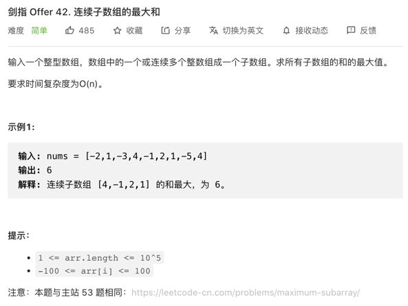

## 第 9 天 动态规划（中等）
[剑指 Offer 42. 连续子数组的最大和](https://leetcode-cn.com/problems/lian-xu-zi-shu-zu-de-zui-da-he-lcof/)

```python
class Solution:
    def maxSubArray(self, nums: List[int]) -> int:
        dp = 0
        dp_max = -float('inf')
        for i, j in enumerate(nums):
            if j+dp>=j:
                dp = j+dp
                dp_max = max(dp, dp_max)
            else:
                dp = j
                dp_max = max(dp_max, dp)
        return dp_max
```
