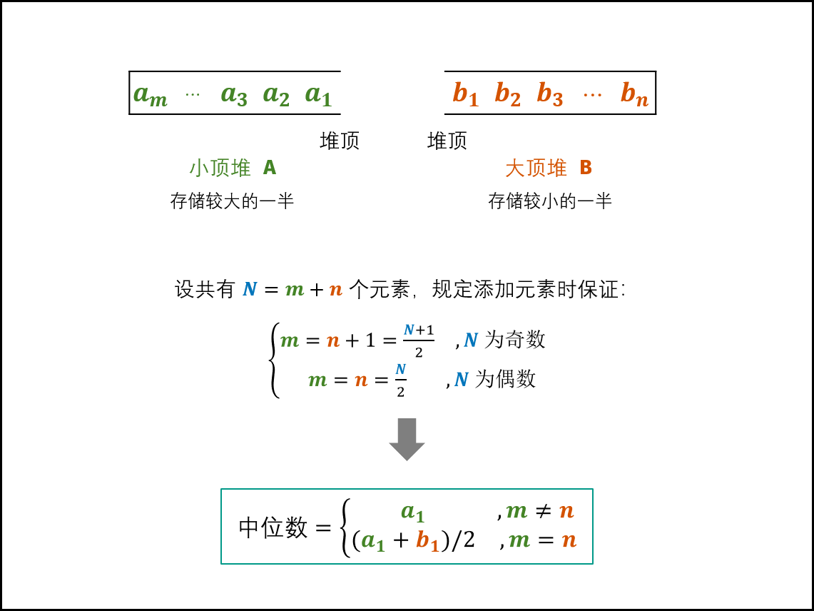

# 剑指 Offer-leetcode练习题
## 第 9 天 动态规划（中等）
[剑指 Offer 42. 连续子数组的最大和](https://leetcode-cn.com/problems/lian-xu-zi-shu-zu-de-zui-da-he-lcof/)

输入一个整型数组，数组中的一个或连续多个整数组成一个子数组。求所有子数组的和的最大值。
要求时间复杂度为O(n)。

```python
class Solution:
    def maxSubArray(self, nums: List[int]) -> int:
        dp = 0
        dp_max = -float('inf')
        for i, j in enumerate(nums):
            if j+dp>=j:
                dp = j+dp
                dp_max = max(dp, dp_max)
            else:
                dp = j
                dp_max = max(dp_max, dp)
        return dp_max
```

[剑指 Offer 47. 礼物的最大价值](https://leetcode-cn.com/problems/li-wu-de-zui-da-jie-zhi-lcof/)

在一个 m*n 的棋盘的每一格都放有一个礼物，每个礼物都有一定的价值（价值大于 0）。你可以从棋盘的左上角开始拿格子里的礼物，并每次向右或者向下移动一格、直到到达棋盘的右下角。给定一个棋盘及其上面的礼物的价值，请计算你最多能拿到多少价值的礼物？
```python
class Solution:
    def maxValue(self, grid: List[List[int]]) -> int:
        # dp[i][j] = max(dp[i-1][j], dp[i][j-1]) + grid[i][j], when i or j is 0 then dealt otherwise
        m, n = len(grid), len(grid[0])
        dp = [[0 for _ in range(n)] for _ in range(m)] # 别写成 dp = [[0]*n]*m]不然会同一个id，导致一个元素变化，三个向量同时变化
        dp[0][0] = grid[0][0] 
        print(dp)
        for i in range(1,n):
            dp[0][i] = dp[0][i-1] + grid[0][i]
        for i in range(1,m):
            dp[i][0] = dp[i-1][0] + grid[i][0]
        for i in range(1,m):
            for j in range(1,n):
                dp[i][j] = max(dp[i][j-1], dp[i-1][j]) + grid[i][j]
        return dp[-1][-1]
```

深拷贝浅拷贝区别：创建dp数组时别用 [[0]*m]*n, 不然不是创建而是浅拷贝。
[说明-1](https://www.runoob.com/w3cnote/python-understanding-dict-copy-shallow-or-deep.html) 、
[说明-2](https://blog.csdn.net/weixin_41888257/article/details/108449289)

## 第 10 天 动态规划（中等）
[剑指 Offer 46. 把数字翻译成字符串](https://leetcode-cn.com/problems/ba-shu-zi-fan-yi-cheng-zi-fu-chuan-lcof/)

```python
class Solution:
    def translateNum(self, num: int) -> int:
        # suppose we have n-digit number, then the answer 
        # for i_th digit endding num should be determined 
        # by i-2_th ans & i-1 to i digit num and i-1_th ans & i digit num 
        s1 = set([str(i) for i in range(26)])
        # print(s1)
        num_str = str(num)
        n = len(num_str)
        dp = [0 for i in range(n)]
        for i, j in enumerate(num_str):
            if i == 0:
                dp[0] = 1
            elif i == 1:
                if num_str[0:2] in s1:
                    dp[1] = 2
                else:
                    dp[1] = 1
            # when i > 1
            else:
                if num_str[i-1:i+1] in s1:
                    dp[i] += dp[i-2]
                dp[i] += dp[i-1]
        return dp[-1]
```
和青蛙跳台阶的题目的确是一样的，只不过判断能否加 *dp[-2]* 罢了

[剑指 Offer 48. 最长不含重复字符的子字符串](https://leetcode-cn.com/problems/zui-chang-bu-han-zhong-fu-zi-fu-de-zi-zi-fu-chuan-lcof/)

长度为 NN 的字符串共有 $\frac{(1+N)N}{2}$ 个子字符串（复杂度为 $O(N^2)$，判断长度为 NN 的字符串是否有重复字符的复杂度为 $O(N)$，因此本题使用暴力法解决的复杂度为 $O(N^3)$ .考虑使用动态规划降低时间复杂度。
[参考1](https://leetcode-cn.com/problems/zui-chang-bu-han-zhong-fu-zi-fu-de-zi-zi-fu-chuan-lcof/solution/mian-shi-ti-48-zui-chang-bu-han-zhong-fu-zi-fu-d-9/)

- 时间复杂度 $O(N)$ ：遍历s
- 空间复杂度 $O(N)$ ：可以优化为 $O(1)$
```python
class Solution:
    def lengthOfLongestSubstring(self, s: str) -> int:
        if s == '':
            return 0
        curr_str = ''
        curr_dp, max_dp = 0, 0
        for i in s:
            # print(i, '-')
            if i not in curr_str:
                curr_str += i
                curr_dp += 1
            else:
                # print(curr_str, curr_str.find(i))
                curr_str = curr_str[curr_str.find(i)+1:] # get the first same str in the first place
                # print(curr_str)
                curr_str += i
                curr_dp = len(curr_str)
            # print(curr_str)
            max_dp = max(max_dp, curr_dp)
        return max_dp
```

## 第 11 天 双指针（简单）
[剑指 Offer 18. 删除链表的节点](https://leetcode-cn.com/problems/shan-chu-lian-biao-de-jie-dian-lcof/)

给定单向链表的头指针和一个要删除的节点的值，定义一个函数删除该节点。返回删除后的链表的头节点。

- 复制一个链表的思路
```python
# Definition for singly-linked list.
# class ListNode:
#     def __init__(self, x):
#         self.val = x
#         self.next = None
class Solution:
    def deleteNode(self, head: ListNode, val: int) -> ListNode:
        if head.val == val:
            return head.next 
        pre = head 
        while head.next is not None:
            if head.next.val == val:
                head.next = head.next.next 
            else:
                head = head.next 
        return pre
```

- 指针，指向目前（curr）以及前一个（pre）的思想 [参考1](https://leetcode-cn.com/problems/shan-chu-lian-biao-de-jie-dian-lcof/solution/mian-shi-ti-18-shan-chu-lian-biao-de-jie-dian-sh-2/)
```python
class Solution:
    def deleteNode(self, head: ListNode, val: int) -> ListNode:
        if head.val == val: return head.next
        pre, cur = head, head.next
        while cur and cur.val != val:
            pre, cur = cur, cur.next
        if cur: pre.next = cur.next
        return head
```

[剑指 Offer 22. 链表中倒数第k个节点](https://leetcode-cn.com/problems/lian-biao-zhong-dao-shu-di-kge-jie-dian-lcof/)

输入一个链表，输出该链表中倒数第k个节点。为了符合大多数人的习惯，本题从1开始计数，即链表的尾节点是倒数第1个节点。

例如，一个链表有 6 个节点，从头节点开始，它们的值依次是 1、2、3、4、5、6。这个链表的倒数第 3 个节点是值为 4 的节点。

- 两次遍历

执行用时：
40 ms
, 在所有 Python3 提交中击败了
37.71%
的用户
内存消耗：
14.9 MB
, 在所有 Python3 提交中击败了
73.97%
的用户
```python
# Definition for singly-linked list.
# class ListNode:
#     def __init__(self, x):
#         self.val = x
#         self.next = None

class Solution:
    def getKthFromEnd(self, head: ListNode, k: int) -> ListNode:
        curr = head 
        n = 0
        while curr:
            n += 1
            curr = curr.next 
        # print(n)
        curr = head
        i = 0
        while n - i > k:
            i += 1
            curr = curr.next 
        return curr
```

- 快慢指针法

执行用时：
32 ms
, 在所有 Python3 提交中击败了
86.62%
的用户
内存消耗：
14.9 MB
, 在所有 Python3 提交中击败了
54.37%
的用户
```python
# Definition for singly-linked list.
# class ListNode:
#     def __init__(self, x):
#         self.val = x
#         self.next = None

class Solution:
    def getKthFromEnd(self, head: ListNode, k: int) -> ListNode:
        fast, slow = head, head 
        while fast and k>0:
            fast, k = fast.next, k-1
        while slow and fast:
            fast, slow = fast.next, slow.next 
        return slow 
```

## 第 12 天 双指针（简单）

[剑指 Offer 25. 合并两个排序的链表](https://leetcode-cn.com/problems/he-bing-liang-ge-pai-xu-de-lian-biao-lcof/)

输入两个递增排序的链表，合并这两个链表并使新链表中的节点仍然是递增排序的。

```python
# Definition for singly-linked list.
# class ListNode:
#     def __init__(self, x):
#         self.val = x
#         self.next = None

class Solution:
    def mergeTwoLists(self, l1: ListNode, l2: ListNode) -> ListNode:
        ans = ListNode()
        curr = ans 
        while l1 and l2:
            if l1.val<=l2.val:
                curr.next = ListNode(l1.val)
                l1 = l1.next 
            else:
                curr.next = ListNode(l2.val)
                l2 = l2.next
            curr = curr.next 
        curr.next = l1 if l1 else l2 # 简洁写法
        return ans.next
```

[剑指 Offer 52. 两个链表的第一个公共节点](https://leetcode-cn.com/problems/liang-ge-lian-biao-de-di-yi-ge-gong-gong-jie-dian-lcof/)

输入两个链表，找出它们的第一个公共节点。

[参考1](https://leetcode-cn.com/problems/liang-ge-lian-biao-de-di-yi-ge-gong-gong-jie-dian-lcof/solution/liang-ge-lian-biao-de-di-yi-ge-gong-gong-pzbs/)

执行用时：
136 ms
, 在所有 Python3 提交中击败了
81.82%
的用户
内存消耗：
30 MB
, 在所有 Python3 提交中击败了
17.90%
的用户
```python
# Definition for singly-linked list.
# class ListNode:
#     def __init__(self, x):
#         self.val = x
#         self.next = None

class Solution:
    def getIntersectionNode(self, headA: ListNode, headB: ListNode) -> ListNode:
        # 本来想把headA的末尾接上headB，如果是循环则可以判断为有交集，但ab都不能有结构变化
        if not headA or not headB:
            return None 
        currA, currB = headA, headB
        while currA != currB:
            currA = headB if not currA else currA.next
            currB = headA if not currB else currB.next
        return currA if currA else None 
```

## 第 13 天 双指针（简单）
[剑指 Offer 21. 调整数组顺序使奇数位于偶数前面](https://leetcode-cn.com/problems/diao-zheng-shu-zu-shun-xu-shi-qi-shu-wei-yu-ou-shu-qian-mian-lcof/)

输入一个整数数组，实现一个函数来调整该数组中数字的顺序，使得所有奇数在数组的前半部分，所有偶数在数组的后半部分。

- 自己解法

执行用时：
56 ms
, 在所有 Python3 提交中击败了
26.25%
的用户
内存消耗：
19.1 MB
, 在所有 Python3 提交中击败了
26.89%
的用户
```python
class Solution:
    def exchange(self, nums: List[int]) -> List[int]:
        n = len(nums)
        left, right = 0, n-1
        while left<=right:
            if nums[left]%2==0 and nums[right]%2==1:
                nums[left], nums[right] = nums[right], nums[left]
            elif nums[left]%2==0 and nums[right]%2==0:
                right -= 1
            elif nums[left]%2==1 and nums[right]%2==1:
                left += 1
            else:
                left, right = left + 1, right - 1
        return nums
```

- [简洁解法](https://leetcode-cn.com/problems/diao-zheng-shu-zu-shun-xu-shi-qi-shu-wei-yu-ou-shu-qian-mian-lcof/solution/mian-shi-ti-21-diao-zheng-shu-zu-shun-xu-shi-qi-4/)
：用位运算提升速度, 指针移动条件其实可以合并
  
执行用时：
44 ms
, 在所有 Python3 提交中击败了
80.96%
的用户
内存消耗：
19 MB
, 在所有 Python3 提交中击败了
62.57%
的用户
```python
class Solution:
    def exchange(self, nums: List[int]) -> List[int]:
        i, j = 0, len(nums) - 1
        while i < j:
            while i < j and nums[i] & 1 == 1: i += 1
            while i < j and nums[j] & 1 == 0: j -= 1
            nums[i], nums[j] = nums[j], nums[i]
        return nums

# 作者：jyd
# 链接：https://leetcode-cn.com/problems/diao-zheng-shu-zu-shun-xu-shi-qi-shu-wei-yu-ou-shu-qian-mian-lcof/solution/mian-shi-ti-21-diao-zheng-shu-zu-shun-xu-shi-qi-4/
# 来源：力扣（LeetCode）
# 著作权归作者所有。商业转载请联系作者获得授权，非商业转载请注明出处。
```

[剑指 Offer 57. 和为s的两个数字](https://leetcode-cn.com/problems/he-wei-sde-liang-ge-shu-zi-lcof/)

输入一个递增排序的数组和一个数字s，在数组中查找两个数，使得它们的和正好是s。如果有多对数字的和等于s，则输出任意一对即可。

关键条件：递增排序

```python
class Solution:
    def twoSum(self, nums: List[int], target: int) -> List[int]:
        left, right = 0, len(nums) - 1
        while left < right:
            while nums[left] + nums[right] > target: right -= 1
            while nums[left] + nums[right] < target: left += 1
            if nums[left]+nums[right]==target: return [nums[left], nums[right]]
        return None
```

[剑指 Offer 58 - I. 翻转单词顺序](https://leetcode-cn.com/problems/fan-zhuan-dan-ci-shun-xu-lcof/)

输入一个英文句子，翻转句子中单词的顺序，但单词内字符的顺序不变。为简单起见，标点符号和普通字母一样处理。例如输入字符串"I am a student. "，则输出"student. a am I"。

```python
class Solution:
    def reverseWords(self, s: str) -> str:
        s = s.strip()
        i = j = len(s) - 1 
        res = []
        # search from the last string 
        while i >= 0:
            while i >= 0 and s[i]!=' ': i -= 1
            res.append(s[i + 1 : j + 1].replace(' ',''))
            while s[i]==' ': i -= 1
            j = i
        return ' '.join(res)
```

## 第 14 天 搜索与回溯算法（中等）

[剑指 Offer 12. 矩阵中的路径](https://leetcode-cn.com/problems/ju-zhen-zhong-de-lu-jing-lcof/)

题目：给定一个 $m x n$ 二维字符网格 $board$ 和一个字符串单词 $word$ 。如果 $word$ 存在于网格中，返回 $true$ ；否则，返回 $false$ 。
单词必须按照字母顺序，通过相邻的单元格内的字母构成，其中“相邻”单元格是那些水平相邻或垂直相邻的单元格。同一个单元格内的字母不允许被重复使用。


- [答案参考1](https://leetcode-cn.com/problems/ju-zhen-zhong-de-lu-jing-lcof/solution/mian-shi-ti-12-ju-zhen-zhong-de-lu-jing-shen-du-yo/)

解题思路：
本问题是典型的矩阵搜索问题，可使用 深度优先搜索（DFS）+ 剪枝 解决。

深度优先搜索： 可以理解为暴力法遍历矩阵中所有字符串可能性。DFS 通过递归，先朝一个方向搜到底，再回溯至上个节点，沿另一个方向搜索，以此类推。

*这个一个理解DFS的很好案例。思路：*

1. 创建helper函数，进行DFS
2. 判断三种访问失败的条件：（1）超过边界（2）当前的字符并不是预估的 word[k] （走了k步）
3. 判断成功条件：k步完成
4. 下一层判断：先把本步已访问过记录下来，再用res作为下一层的判断，回溯后，恢复本步的字符

```python3
class Solution:
    def exist(self, board: List[List[str]], word: str) -> bool:
        def dfs(i, j, k):
            if not 0 <= i < len(board) or not 0 <= j < len(board[0]) or board[i][j] != word[k]:
                return False
            if k == len(word) - 1:
                return True
            board[i][j] = '' # 当作当前字符已经访问过，所以下一层没有办法走回头路
            res = dfs(i-1, j, k+1) or dfs(i+1, j, k+1) or dfs(i, j-1, k+1) or dfs(i, j+1, k+1)
            board[i][j] = word[k] # 1. 回溯时需要恢复[i][j]位置的字符 2. 为何用word[k]?-由于是匹配上了，所以可用word[k]
            return res 
        
        for i in range(len(board)):
            for j in range(len(board[0])):
                if dfs(i, j, 0):
                    return True 
        return False
```

[剑指 Offer 13. 机器人的运动范围](https://leetcode-cn.com/problems/ji-qi-ren-de-yun-dong-fan-wei-lcof/)

题目：地上有一个m行n列的方格，从坐标 [0,0] 到坐标 [m-1,n-1] 。一个机器人从坐标 [0, 0] 的格子开始移动，它每次可以向左、右、上、下移动一格（不能移动到方格外），也不能进入行坐标和列坐标的数位之和大于k的格子。例如，当k为18时，机器人能够进入方格 [35, 37] ，因为3+5+3+7=18。但它不能进入方格 [35, 38]，因为3+5+3+8=19。请问该机器人能够到达多少个格子？

[参考1](https://leetcode-cn.com/problems/ji-qi-ren-de-yun-dong-fan-wei-lcof/solution/ji-qi-ren-de-yun-dong-fan-wei-by-leetcode-solution/)
- 解法1：从左上往右下搜索
```python3
class Solution:
    def movingCount(self, m: int, n: int, k: int) -> int:
        s1 = set([(0,0), ])
        for i in range(m):
            for j in range(n):
                if ((i-1, j) in s1 or (i, j-1) in s1) and i//10 + i%10 + j//10 + j%10 <= k:
                    s1.add((i, j))
        # print(s1)
        return len(s1)
```

## 第 15 天 搜索与回溯算法（中等）

[剑指 Offer 34. 二叉树中和为某一值的路径](https://leetcode-cn.com/problems/er-cha-shu-zhong-he-wei-mou-yi-zhi-de-lu-jing-lcof/)

给你二叉树的根节点 root 和一个整数目标和 targetSum ，找出所有 从根节点到叶子节点 路径总和等于给定目标和的路径。

叶子节点 是指没有子节点的节点。


```python
# Definition for a binary tree node.
# class TreeNode:
#     def __init__(self, val=0, left=None, right=None):
#         self.val = val
#         self.left = left
#         self.right = right
class Solution:
    def pathSum(self, root: TreeNode, target: int) -> List[List[int]]:
        # 到了叶子结点，还没到target，返回false
        total_ans = []
        ans = []
        def dfs(curr, k):
            if not curr:
                return 
            ans.append(curr.val)
            if not curr.left and not curr.right and k + curr.val == target:
                total_ans.append(list(ans)) # 注意这里不能写ans，因为是引用，而ans最终是回撤清空的；不做浅层copy
            dfs(curr.left, k + curr.val) 
            dfs(curr.right, k + curr.val)
            ans.pop()

        dfs(root, 0)
        return total_ans
```

- DFS写法
```python
ans, total_ans = [], []
def dfs(root):
    if not root:
        return 
    ans.append(root.val)
    if not curr.left and not curr.right:
        total_ans.append(list(ans))
    dfs(root.left)
    dfs(root.right)
    ans.pop()
```

[剑指 Offer 36. 二叉搜索树与双向链表](https://leetcode-cn.com/problems/er-cha-sou-suo-shu-yu-shuang-xiang-lian-biao-lcof/)

输入一棵二叉搜索树，将该二叉搜索树转换成一个排序的循环双向链表。要求不能创建任何新的节点，只能调整树中节点指针的指向。

```python
"""
# Definition for a Node.
class Node:
    def __init__(self, val, left=None, right=None):
        self.val = val
        self.left = left
        self.right = right
"""
class Solution:
    def treeToDoublyList(self, root: 'Node') -> 'Node':
        if not root:
            return None
        stack = list()
        def dfs(curr):
            if not curr:
                return 
            if curr.left:
                dfs(curr.left)
            stack.append(curr)
            if curr.right:
                dfs(curr.right)
        dfs(root)

        n = len(stack)
        for i, j in enumerate(stack):
            j.left = stack[(i + n - 1)%n]
            j.right = stack[(i + n + 1)%n]
        return stack[0]
```

[剑指 Offer 54. 二叉搜索树的第k大节点](https://leetcode-cn.com/problems/er-cha-sou-suo-shu-de-di-kda-jie-dian-lcof/)

给定一棵二叉搜索树，请找出其中第 $k$ 大的节点的值。

- 存储后进行判断

```python
# Definition for a binary tree node.
# class TreeNode:
#     def __init__(self, x):
#         self.val = x
#         self.left = None
#         self.right = None

class Solution:
    def kthLargest(self, root: TreeNode, k: int) -> int:
        if not root:
            return None
        stack = []
        def dfs(curr):
            if not curr:
                return 
            if curr.left:
                dfs(curr.left)
            stack.append(curr.val)
            if curr.right:
                dfs(curr.right)
        
        dfs(root)
        return stack[-k]
```

- 提前判断退出 [参考题解1](https://leetcode-cn.com/problems/er-cha-sou-suo-shu-de-di-kda-jie-dian-lcof/solution/mian-shi-ti-54-er-cha-sou-suo-shu-de-di-k-da-jie-d/)

复杂度分析：
时间复杂度 O(N)： 当树退化为链表时（全部为右子节点），无论 k 的值大小，递归深度都为 N

空间复杂度 O(N)： 当树退化为链表时（全部为右子节点），系统使用 O(N) 大小的栈空间。


```python
# Definition for a binary tree node.
# class TreeNode:
#     def __init__(self, x):
#         self.val = x
#         self.left = None
#         self.right = None

class Solution:
    def kthLargest(self, root: TreeNode, k: int) -> int:
        def dfs(curr):
            if not curr:
                return 
            dfs(curr.right)
            if self.k == 0:
                return 
            self.k -= 1
            if self.k == 0:
                self.res = curr.val 
            dfs(curr.left)
        
        self.k = k 
        dfs(root)
        return self.res 
```

## 第 16 天 排序（简单）

[剑指 Offer 45. 把数组排成最小的数](https://leetcode-cn.com/problems/ba-shu-zu-pai-cheng-zui-xiao-de-shu-lcof/)

输入一个非负整数数组，把数组里所有数字拼接起来排成一个数，打印能拼接出的所有数字中最小的一个。


- [参考](https://leetcode-cn.com/problems/ba-shu-zu-pai-cheng-zui-xiao-de-shu-lcof/solution/mian-shi-ti-45-ba-shu-zu-pai-cheng-zui-xiao-de-s-4/)

用 sort(key = functools.cmp_to_key(func))

```python
class Solution:
    def minNumber(self, nums: List[int]) -> str:
        def sort_value(a,b):
            x, y = a + b, b + a
            if x > y: return 1
            elif x < y: return -1  # 相当于a less than b，a应该排在前面
            else: return 0

        strs = [str(num) for num in nums]
        strs.sort(key = functools.cmp_to_key(sort_value))
        return ''.join(strs)
```

[剑指 Offer 61. 扑克牌中的顺子](https://leetcode-cn.com/problems/bu-ke-pai-zhong-de-shun-zi-lcof/)

从若干副扑克牌中随机抽 5 张牌，判断是不是一个顺子，即这5张牌是不是连续的。2～10为数字本身，A为1，J为11，Q为12，K为13，而大、小王为 0 ，可以看成任意数字。A 不能视为 14。

```python
class Solution:
    def isStraight(self, nums: List[int]) -> bool:
        s = set()
        max_num, min_num = 0, 14
        for num in nums:
            if num == 0: continue
            max_num = max(max_num, num)
            min_num = min(min_num, num)
            if num in s:
                return False
            s.add(num)
        if max_num - min_num < 5:
            return True 
        else:
            return False
```

## 第 17 天 排序（中等）

[剑指 Offer 40. 最小的k个数](https://leetcode-cn.com/problems/zui-xiao-de-kge-shu-lcof/)

输入整数数组 arr ，找出其中最小的 k 个数。例如，输入4、5、1、6、2、7、3、8这8个数字，则最小的4个数字是1、2、3、4。


- 快排

```python
def quick_sort(arr, l, r): # 快排
    if l >= r:
        return 
    i, j = l, r
    while i < j:
        while i < j and arr[j] >= arr[l]: j -= 1
        while i < j and arr[i] <= arr[i]: i += 1
        arr[i], arr[j] = arr[i], arr[j]
    arr[l], arr[i] = arr[i], arr[l]
    quick_sort(arr, l, i - 1)
    quick_sort(arr, i + 1, r)
```

[剑指 Offer 41. 数据流中的中位数(困难)](https://leetcode-cn.com/problems/shu-ju-liu-zhong-de-zhong-wei-shu-lcof/)

如何得到一个数据流中的中位数？如果从数据流中读出奇数个数值，那么中位数就是所有数值 *排序之后* 位于中间的数值。如果从数据流中读出偶数个数值，那么中位数就是所有数值排序之后中间两个数的平均值。

- [参考](https://leetcode-cn.com/problems/shu-ju-liu-zhong-de-zhong-wei-shu-lcof/solution/mian-shi-ti-41-shu-ju-liu-zhong-de-zhong-wei-shu-y/)
  
  - 核心逻辑：实时地分割出来大的一半和小的一半，"分割线"为中位数：所以从大的部分里面找最小的，从小的部分找最大的，一取平均就是中位数。
  - 实现
    - 比中位数大的部分 & 能够返回最小的一个：小顶堆
    - 比中位数小的部分 & 能够返回最大的一个：大顶堆（由于Python 中 heapq 模块是小顶堆。所以实现 大顶堆 方法： 小顶堆的插入和弹出操作均将元素 取反 即可。）
  




```python
from heapq import * 

class MedianFinder:
    def __init__(self):
        self.A = [] # 小顶堆，保存较大的一半
        self.B = [] # 大顶堆，保存较小的一半

    def addNum(self, num: int) -> None:
        if len(self.A)!=len(self.B):
            # heappush(self.A, num)
            # heappush(self.B, -heappop(self.A))
            heappush(self.B, -heappushpop(self.A, num)) # 代替两行更加简洁
        else:
            # heappush(self.B, -num)
            # heappush(self.A, -heappop(self.B))
            heappush(self.A, -heappushpop(self.B, -num)) # 更加简洁
    
    def findMedian(self) -> float:
        return self.A[0] if len(self.A)!=len(self.B) else (self.A[0] - self.B[0]) / 2.0
```

## 第 18 天 搜索与回溯算法（中等）

[剑指 Offer 55 - I. 二叉树的深度](https://leetcode-cn.com/problems/er-cha-shu-de-shen-du-lcof/)

输入一棵二叉树的根节点，求该树的深度。从根节点到叶节点依次经过的节点（含根、叶节点）形成树的一条路径，最长路径的长度为树的深度。

- 普通的递归 recursion

```python
class Solution:
    def maxDepth(self, root: TreeNode) -> int:
        if not root: return 0 
        return max(self.maxDepth(root.left), self.maxDepth(root.right)) + 1
```

- DFS

```python
# Definition for a binary tree node.
# class TreeNode:
#     def __init__(self, x):
#         self.val = x
#         self.left = None
#         self.right = None

class Solution:
    def maxDepth(self, root: TreeNode) -> int:
        self.depth, self.depth_max = 0, 0
        def dfs(curr):
            # print(curr.val, self.depth)
            if not curr:
                return 
            self.depth += 1
            if not curr.left and not curr.right:
                self.depth_max = max(self.depth_max, self.depth)
                return 
            dfs(curr.left)
            if curr.left:
                self.depth -= 1
            dfs(curr.right)
            if curr.right:
                self.depth -= 1
            
        dfs(root)
        return self.depth_max
```

- 层序遍历（BFS）:在时空上应该是最快的

```python
class Solution:
    def maxDepth(self, root: TreeNode) -> int:
        if not root: return 0 
        queue, res = [root, ], 0
        while queue:
            tmp = []
            for node in queue:
                if node.left: tmp.append(node.left)
                if node.right: tmp.append(node.right)
            queue = tmp 
            res += 1
        return res
```

[剑指 Offer 55 - II. 平衡二叉树](https://leetcode-cn.com/problems/ping-heng-er-cha-shu-lcof/)

输入一棵二叉树的根节点，判断该树是不是平衡二叉树。如果某二叉树中任意节点的左右子树的深度相差不超过1，那么它就是一棵平衡二叉树。

- 时间复杂度：$O(n^2)$，其中 $n$ 是二叉树中的节点个数。
最坏情况下，二叉树是满二叉树，需要遍历二叉树中的所有节点。
对于节点 $p$，如果它的高度是 $d$，则 $cnt(p)$ 最多会被调用 $d$ 次
  （即遍历到它的每一个祖先节点时）。对于平均的情况，一棵树的高度 $h$ 满足 $O(h)=O(log n)$，因为 $d \leq h$，所以总时间复杂度为 $O(n log n)$。
  对于最坏的情况，二叉树形成链式结构，高度为 $O(n)$，此时总时间复杂度为 $O(n^2)$


```python
# Definition for a binary tree node.
# class TreeNode:
#     def __init__(self, x):
#         self.val = x
#         self.left = None
#         self.right = None

class Solution:
    def isBalanced(self, root: TreeNode) -> bool:
        def cnt(curr):
            if not curr: 
                return 0 
            else:
                return max(cnt(curr.left), cnt(curr.right)) + 1

        if not root:
            return True
        if abs(cnt(root.left) - cnt(root.right)) >= 2:
            return False
        else:
            return self.isBalanced(root.left) and self.isBalanced(root.right)
```

## 第 19 天 搜索与回溯算法（中等）

[剑指 Offer 64. 求1+2+…+n](https://leetcode-cn.com/problems/qiu-12n-lcof/)

求 1+2+...+n ，要求不能使用乘除法、for、while、if、else、switch、case等关键字及条件判断语句（A?B:C）。


[剑指 Offer 68 - I. 二叉搜索树的最近公共祖先](https://leetcode-cn.com/problems/er-cha-sou-suo-shu-de-zui-jin-gong-gong-zu-xian-lcof/)

- 没有充分利用二叉搜索树性质的DFS：时间复杂度排名约10%

先找两个节点的共同路径，然后再逆序寻找第一个出现的共同节点（足够深）

```python
# Definition for a binary tree node.
# class TreeNode:
#     def __init__(self, x):
#         self.val = x
#         self.left = None
#         self.right = None

class Solution:
    def lowestCommonAncestor(self, root: 'TreeNode', p: 'TreeNode', q: 'TreeNode') -> 'TreeNode':
        res = []
        self.ans = []
        def dfs(curr, k):
            if curr:
                res.append(curr)
                if curr == k:
                    self.ans = list(res)
                dfs(curr.left, k)
                dfs(curr.right, k)
                res.pop()
            
        dfs(root, p)
        ans1 = self.ans
        self.ans = []
        dfs(root, q)
        ans2 = self.ans
        # print(ans1, ans2)
        for i in ans1[::-1]:
            for j in ans2[::-1]:
                if i == j:
                    return i
```

- 考虑二叉搜索树性质的，在找路径时，需要判断根节点和需要寻找的节点大小关系：如果要找的节点小，那么在左子树，反之则在右子树

时间复杂度：
```python
class Solution:
    def lowestCommonAncestor(self, root: 'TreeNode', p: 'TreeNode', q: 'TreeNode') -> 'TreeNode':
        def findPath(curr, k):
            path = list()
            while curr.val != k.val:
                path.append(curr)
                if k.val < curr.val:
                    curr = curr.left 
                else:
                    curr = curr.right
            path.append(k)
            return path 
        
        path1, path2 = findPath(root, p), findPath(root, q)
        for i in path1[::-1]:
            for j in path2[::-1]:
                if i == j:
                    return i
```

- [参考：一次遍历](https://leetcode-cn.com/problems/er-cha-sou-suo-shu-de-zui-jin-gong-gong-zu-xian-lcof/solution/er-cha-sou-suo-shu-de-zui-jin-gong-gong-0wpw1/)

把两个节点放在同一个判断力，一次遍历。如果都小，则都在左边；如果都大，那么都在右边；其他情况说明是分叉口。

```python
class Solution:
    def lowestCommonAncestor(self, root: TreeNode, p: TreeNode, q: TreeNode) -> TreeNode:
        ancestor = root
        while True:
            if p.val < ancestor.val and q.val < ancestor.val:
                ancestor = ancestor.left
            elif p.val > ancestor.val and q.val > ancestor.val:
                ancestor = ancestor.right
            else:
                break
        return ancestor
```

## 第 20 天 分治算法（中等）

[剑指 Offer 07. 重建二叉树](https://leetcode-cn.com/problems/zhong-jian-er-cha-shu-lcof/)

输入某二叉树的前序遍历和中序遍历的结果，请构建该二叉树并返回其根节点。

- 逻辑：其实简单题，因为前序遍历（根，左，右）和中序遍历（左，根，右）是能够切分开来，问题即定位根节点
- 复杂度：如果用列表的index方法，那么定位根节点需要$O(N)$

```python
# Definition for a binary tree node.
# class TreeNode:
#     def __init__(self, x):
#         self.val = x
#         self.left = None
#         self.right = None
         
class Solution:
    def buildTree(self, preorder: List[int], inorder: List[int]) -> TreeNode:
        if not preorder and not inorder:
            return None
        if len(preorder)==len(inorder)==1:
            return TreeNode(preorder[0])
        mid = inorder.index(preorder[0])
        curr = TreeNode(preorder[0])
        curr.left = self.buildTree(
          preorder[1: mid + 1], inorder[0: mid]
        )
        curr.right = self.buildTree(
          preorder[mid + 1:], inorder[ mid + 1:]
        )
        return curr   
```

- 优化：用哈希表来优化查询速度(从 17% ——> 67%)

```python
class Solution:
    def buildTree(self, preorder: List[int], inorder: List[int]) -> TreeNode:
        def helper(pre_pos, in_pos):
            pre_left, pre_right = pre_pos
            in_left, in_right = in_pos
            if pre_left > pre_right:
                return None
            root = preorder[pre_left]
            mid = inorder_index[root]
            curr = TreeNode(root)
            inorder_gap = mid - in_left
            curr.left = helper(
              (pre_left + 1, pre_left + inorder_gap), (in_left, mid - 1)
            )
            curr.right = helper(
                (pre_left + inorder_gap + 1, pre_right), (mid + 1, in_right)
            )
            return curr 
        
        inorder_index = {element: i for i, element in enumerate(inorder)}
        n = len(inorder)
        return helper((0, n-1), (0, n-1))
```


[剑指 Offer 16. 数值的整数次方](https://leetcode-cn.com/problems/shu-zhi-de-zheng-shu-ci-fang-lcof/)

实现 pow(x, n) ，即计算 x 的 n 次幂函数。不得使用库函数，同时不需要考虑大数问题。

[解答：快速幂](https://leetcode-cn.com/problems/shu-zhi-de-zheng-shu-ci-fang-lcof/solution/mian-shi-ti-16-shu-zhi-de-zheng-shu-ci-fang-kuai-s/)

```python
class Solution:
    def myPow(self, x: float, n: int) -> float:
        if x == 0: # 因为下方有 1/x
            return x
        if n < 0:
            x, n = 1/x, - n
        res = 1
        while n:
            if n & 1:
                res *= x
            x *= x 
            n >>= 1
        return res
```


[剑指 Offer 33. 二叉搜索树的后序遍历序列](https://leetcode-cn.com/problems/er-cha-sou-suo-shu-de-hou-xu-bian-li-xu-lie-lcof/)

输入一个整数数组，判断该数组是不是某二叉搜索树的后序遍历结果。如果是则返回 true，否则返回 false。假设输入的数组的任意两个数字都互不相同。

```python
class Solution:
    def verifyPostorder(self, postorder: List[int]) -> bool:
        def helper(i, j):
            if i >= j:
                return True
            pos = i
            while postorder[pos] < postorder[j]:
                pos += 1
            mark = pos 
            while postorder[pos] > postorder[j]:
                pos += 1
            return pos == j and helper(i, mark - 1) and helper(mark, j - 1)
        return helper(0, len(postorder) - 1)
```

## 第 21 天 位运算（简单）

[剑指 Offer 15. 二进制中1的个数](https://leetcode-cn.com/problems/er-jin-zhi-zhong-1de-ge-shu-lcof/)

编写一个函数，输入是一个无符号整数（以二进制串的形式），返回其二进制表达式中数字位数为 '1' 的个数（也被称为 汉明重量).）。

```python
class Solution:
    def hammingWeight(self, n: int) -> int:
        cnt = 0
        while n > 0:
            cnt += n & 1
            n >>= 1
        return cnt 
```


[剑指 Offer 65. 不用加减乘除做加法](https://leetcode-cn.com/problems/bu-yong-jia-jian-cheng-chu-zuo-jia-fa-lcof/)

写一个函数，求两个整数之和，要求在函数体内不得使用 “+”、“-”、“*”、“/” 四则运算符号。

[参考](https://leetcode-cn.com/problems/bu-yong-jia-jian-cheng-chu-zuo-jia-fa-lcof/solution/mian-shi-ti-65-bu-yong-jia-jian-cheng-chu-zuo-ji-7/)

```python
class Solution:
    def add(self, a: int, b: int) -> int:
        x = 0xffffffff
        a, b = a & x, b & x
        while b != 0:
            a, b = (a ^ b), (a & b) << 1 & x
        return a if a <= 0x7fffffff else ~(a ^ x)
```

## 第 23 天 数学（简单）

[剑指 Offer 39. 数组中出现次数超过一半的数字](https://leetcode-cn.com/problems/shu-zu-zhong-chu-xian-ci-shu-chao-guo-yi-ban-de-shu-zi-lcof/)

数组中有一个数字出现的次数超过数组长度的一半，请找出这个数字。

- 解法
  - 哈希表
  - 排序后找中间位置数字
  - 摩尔投票法（符合空间复杂度 $O(1)$ ）[link](https://leetcode-cn.com/problems/shu-zu-zhong-chu-xian-ci-shu-chao-guo-yi-ban-de-shu-zi-lcof/solution/mian-shi-ti-39-shu-zu-zhong-chu-xian-ci-shu-chao-3/)

```python
class Solution:
    def majorityElement(self, nums: List[int]) -> int:
        votes = 0
        for num in nums:
            if votes == 0:
                x = num 
            votes += 1 if num == x else -1 
        return x
```

[剑指 Offer 66. 构建乘积数组](https://leetcode-cn.com/problems/gou-jian-cheng-ji-shu-zu-lcof/)

给定一个数组 A[0,1,…,n-1]，请构建一个数组 B[0,1,…,n-1]，其中 B[i] 的值是数组 A 中除了下标 i 以外的元素的积, 即 B[i]=A[0]×A[1]×…×A[i-1]×A[i+1]×…×A[n-1]。不能使用除法。


- 循规蹈矩的解法，判断每个位置的两端的乘积

```python
class Solution:
    def constructArr(self, a: List[int]) -> List[int]:
        c, d = list(a), list(a) 
        for i in range(1, len(c)):
            c[i] = c[i-1] * c[i]
        for i in range(len(d)-2, -1, -1):
            d[i] = d[i+1] * d[i]
        ans = [0 for _ in range(len(a))]
        for i in range(len(ans)):
            if i == 0:
                ans[i] = d[1]
            elif i == len(ans)-1:
                ans[i] = c[len(ans)-2]
            else:
                ans[i] = c[i-1] * d[i+1]   
        return ans 
```
- 优化空间复杂度: [图解：上下三角](https://leetcode-cn.com/problems/gou-jian-cheng-ji-shu-zu-lcof/solution/mian-shi-ti-66-gou-jian-cheng-ji-shu-zu-biao-ge-fe/)

```python
class Solution:
    def constructArr(self, a: List[int]) -> List[int]:
        b, tmp = [1] * len(a), 1
        for i in range(1, len(a)):
            b[i] = b[i-1] * a[i-1]
        for i in range(len(a) - 2, -1, -1):
            tmp *= a[i + 1]
            b[i] *= tmp 
        return b 
```

## 第 24 天 数学（中等）

[剑指 Offer 14- I. 剪绳子](https://leetcode-cn.com/problems/jian-sheng-zi-lcof/)

给你一根长度为 n 的绳子，请把绳子剪成整数长度的 m 段（m、n都是整数，n>1并且m>1），每段绳子的长度记为 k[0],k[1]...k[m-1] 。请问 k[0]*k[1]*...*k[m-1] 可能的最大乘积是多少？例如，当绳子的长度是8时，我们把它剪成长度分别为2、3、3的三段，此时得到的最大乘积是18。

```python
class Solution:
    def cuttingRope(self, n: int) -> int:
        if n <= 3: 
            return n - 1
        a, b = n // 3, n % 3
        if b == 0:
            return int(math.pow(3, a))
        elif b == 1:
            return int(math.pow(3, a - 1) * 4)
        else:
            return int(math.pow(3, a) * 2)
```

- 解答：
  - 注：Python 中常见有三种幂计算函数： * 和 pow() 的时间复杂度均为 O(\log a)；而 math.pow() 始终调用 C 库的 pow() 函数，其执行浮点取幂，时间复杂度为 O(1)。
  - 应该尽可能地瓜分为长度为3的分段[数学推导](https://leetcode-cn.com/problems/jian-sheng-zi-lcof/solution/mian-shi-ti-14-i-jian-sheng-zi-tan-xin-si-xiang-by/)

[剑指 Offer 14- II. 剪绳子 II](https://leetcode-cn.com/problems/jian-sheng-zi-ii-lcof/)

- [解法参考](https://leetcode-cn.com/problems/jian-sheng-zi-ii-lcof/solution/mian-shi-ti-14-ii-jian-sheng-zi-iitan-xin-er-fen-f/)
  - 循环求余
  - 快速幂求余
  
  
[剑指 Offer 57 - II. 和为s的连续正数序列](https://leetcode-cn.com/problems/he-wei-sde-lian-xu-zheng-shu-xu-lie-lcof/)

输入一个正整数 target ，输出所有和为 target 的连续正整数序列（至少含有两个数）。

序列内的数字由小到大排列，不同序列按照首个数字从小到大排列。

- 利用求和公式
    - 举一反三：如果不是连续正整数序列，而是间隔2如何处理？——实际上就是修改求和公式，再更新公式
  
```python
class Solution:
    def findContinuousSequence(self, target: int):
        i, j, res = 1, 2, []
        while i < j:
            j = (-1 + (1 + 4 * (2 * target + i * i - i)) ** 0.5) / 2
            if i < j and j == int(j):
                res.append(list(range(i, int(j) + 1)))
            i += 1
        return res
```


[剑指 Offer 62. 圆圈中最后剩下的数字](https://leetcode-cn.com/problems/yuan-quan-zhong-zui-hou-sheng-xia-de-shu-zi-lcof/)

- [约瑟夫环：加强理解](https://leetcode-cn.com/problems/yuan-quan-zhong-zui-hou-sheng-xia-de-shu-zi-lcof/solution/jian-zhi-offer-62-yuan-quan-zhong-zui-ho-dcow/)


